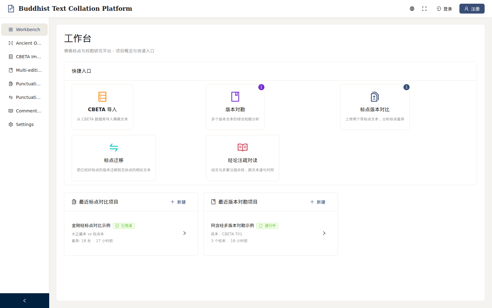
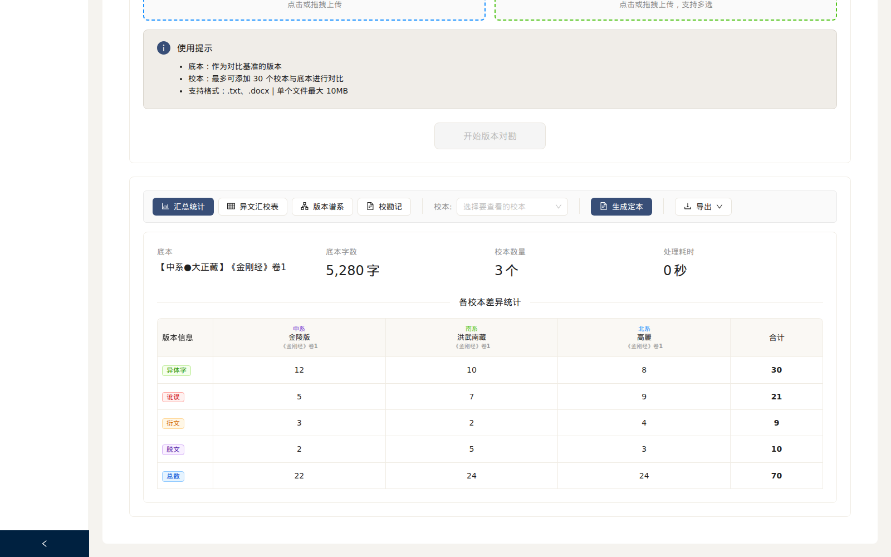

# Buddhist Text Collation Platform

[中文 README](README.md) · **English**

[](https://github.com/xr843/Buddhist-Text-Collation/actions/workflows/ci.yml)
[](LICENSE)
[](https://www.python.org/)
[](https://react.dev/)
[](https://fastapi.tiangolo.com/)

> **One-line** · A unified research workbench for **punctuation diff,
> multi-edition collation, commentary cross-reading, and version-lineage
> analysis** of Buddhist canonical texts.

🛡️ [Security](SECURITY.md) · 🤝 [Contributing](CONTRIBUTING.md) · 🗺️ [Roadmap](ROADMAP.en.md) · 📝 [Changelog](CHANGELOG.md)

---

## Screenshots

| Module | Preview |
|---|---|
| Workspace Overview |  |
| Commentary Parallel Reading | sutra text + multiple commentaries side-by-side, sentence-aligned |
| Multi-edition Collation |  |
| Punctuation Diff | upload two punctuated editions for visual diff + analysis |
| Punctuation Transfer | map punctuation from a polished edition to an unpunctuated one |

See [`docs/screenshots/`](docs/screenshots/) — high-fidelity captures
with real data are tracked in [#26](../../issues/26).

## What is this?

A research workbench that unifies the textual-criticism workflow for
Buddhist canonical texts: punctuation diff, multi-edition collation,
commentary cross-reading, and version-lineage analysis. It integrates
open scholarly resources (CBETA, DILA) and ships with a focused reading
UI suited to long collation sessions.

## Key Features

| Module | Capability |
|---|---|
| Punctuation Diff | per-file multi-edition diff, sentence-level adjudication |
| Two-Edition Collation | line/char diff, variant-character recognition, decision tracking |
| Multi-Edition Collation | up to 31 editions in one workspace, auto-generated collation notes |
| Commentary Reading | sutra + commentaries side-by-side, cross-text citations |
| Version Lineage | variant clustering, lineage-graph generation |
| Collaboration | projects, members, roles, annotations, edit locks |
| Export | TXT / DOCX / collation-note CSV / full alignment table |

## Tech Stack

- **Backend**: Python 3.11 · FastAPI · SQLAlchemy (async) · PostgreSQL · Redis
- **Frontend**: React 18 · TypeScript · Vite · Zustand · Ant Design
- **Infra**: Docker Compose · nginx · Umami (optional analytics)

Architecture: [docs/ARCHITECTURE.md](docs/ARCHITECTURE.md) ·
Auth: [docs/AUTH.md](docs/AUTH.md) ·
Collaboration: [docs/COLLAB.md](docs/COLLAB.md) ·
Admin: [docs/ADMIN.md](docs/ADMIN.md)

## 3-minute Try

Don't want to set up the stack first? Browse [`examples/`](examples/) for
public-domain samples. A single `diff` shows the kind of textual
variation this platform highlights and writes into a collation note.

```bash
diff examples/classical-chinese-sample/punctuated.txt \
     examples/classical-chinese-sample/variant.txt
```

Once the platform is running, upload the two sample files to
**Two-Edition Collation** or **Punctuation Transfer** to walk the full
path locally.

## Quick Start

### Prerequisites

- Python 3.11+
- Node.js 20+
- PostgreSQL 14+ and Redis 7+ (Docker is fine for development)

### Clone & configure

```bash
git clone https://github.com/xr843/Buddhist-Text-Collation.git
cd Buddhist-Text-Collation

cp .env.example .env
cp backend/.env.example backend/.env

# Generate SECRET_KEY
python3 -c "import secrets; print(secrets.token_urlsafe(48))"
# paste into backend/.env as SECRET_KEY
```

### Install

```bash
# Backend
cd backend
python -m venv venv && source venv/bin/activate
pip install -r requirements.txt

# Frontend
cd ../frontend
npm install
```

### Run

```bash
./start_backend.sh    # http://localhost:8001
./start_frontend.sh   # http://localhost:5173
```

### Docker

```bash
docker-compose up -d --build
```

See [docs/DEPLOYMENT_CHECKLIST.md](docs/DEPLOYMENT_CHECKLIST.md) and
[docs/WSL_SETUP.md](docs/WSL_SETUP.md) for production guidance.

## Data Resources

This repo does **not** redistribute copyrighted modern punctuated
editions. Public sources you can wire up:

- [CBETA](https://www.cbeta.org/) — cite per their terms of use
- [DILA](https://www.dila.edu.tw/) — CC-BY-NC-SA and similar licenses
- Your own collation work

Large derived datasets (variant indices, alignment caches) are
distributed via GitHub Releases, not committed to the repo.

## Security

Read the **Deployment Requirements** in [SECURITY.md](SECURITY.md) before
exposing the platform publicly. Report vulnerabilities privately via
GitHub Security Advisories — please do **not** open a public issue.

## Acknowledgements

This project stands on the shoulders of:

- [CBETA — Chinese Buddhist Electronic Text Association](https://www.cbeta.org/)
- [DILA — Dharma Drum Institute of Liberal Arts Digital Archives](https://www.dila.edu.tw/)
- [Variant Character Dictionary / Unihan / IDS](https://www.unicode.org/charts/unihan.html)
- Every researcher and volunteer who has quietly contributed to the
  digitization of canonical Buddhist texts.

## License

[GNU Affero General Public License v3.0](LICENSE).

AGPL was chosen so that derivative works — including network-deployed
services — remain open, in keeping with the open-knowledge ethos of
Buddhist textual scholarship.
