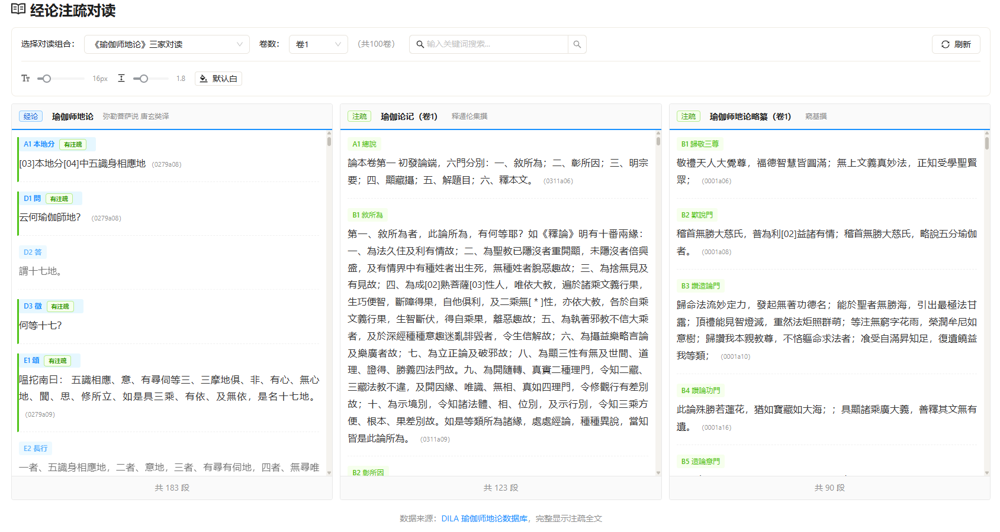
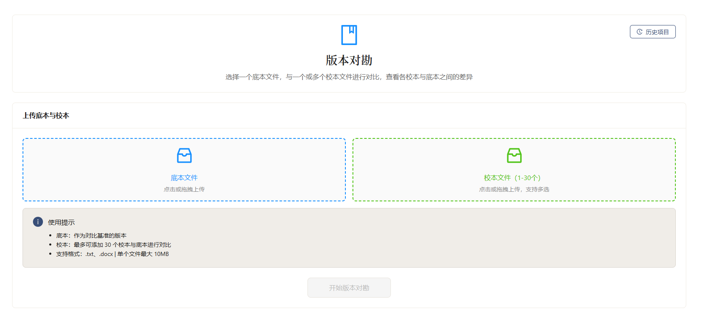
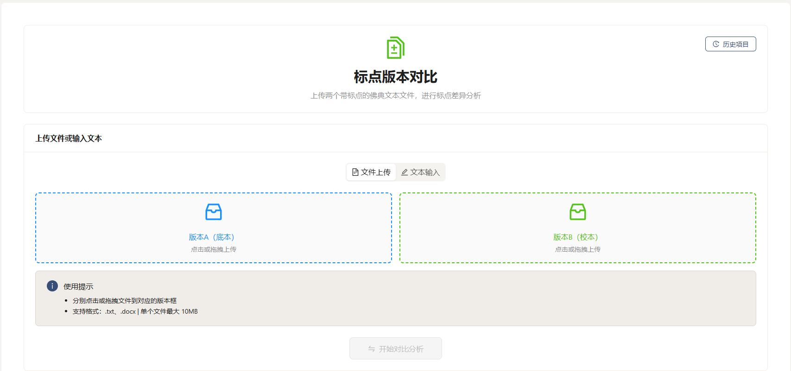
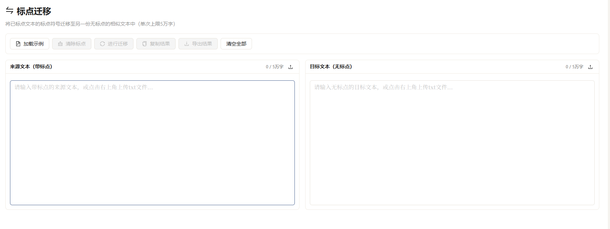

# 佛典标点与校勘研究平台 / Buddhist Text Collation Platform

**中文** · [English](README.en.md)

[](https://github.com/xr843/Buddhist-Text-Collation/actions/workflows/ci.yml)
[](LICENSE)
[](https://www.python.org/)
[](https://react.dev/)
[](https://fastapi.tiangolo.com/)
[](#致谢--acknowledgements)
[](#致谢--acknowledgements)

> **一句话** · 把佛经古籍的"标点对比、多版本对勘、注疏对读、版本谱系"统一进同一个研究工作台。
>
> **One line** · A unified research workbench for punctuation diff, multi-edition collation, commentary cross-reading, and version-lineage analysis of Buddhist canonical texts.

📖 详细中文文档 / Full Chinese docs: **[docs/README.zh-CN.md](docs/README.zh-CN.md)** · 🛡️ 安全 / Security: **[SECURITY.md](SECURITY.md)** · 🤝 参与 / Contribute: **[CONTRIBUTING.md](CONTRIBUTING.md)** · 🗺️ 路线图 / Roadmap: **[ROADMAP.md](ROADMAP.md)** · 📝 更新日志 / Changelog: **[CHANGELOG.md](CHANGELOG.md)**

---

## 界面预览 / Screenshots

### 工作台概览 / Workspace Overview
> 五个核心入口集中在一个研究工作台，便于快速进入导入、对勘、标点和注疏流程。
> Five core entry points in one research dashboard for import, collation, punctuation, and commentary workflows.


### 经论注疏对读 / Commentary Parallel Reading
> 经文与多家注疏三栏并排，跨文本逐句对照
> Sutra text and multiple commentaries side-by-side, sentence-aligned.



### 多版本对勘 / Multi-edition Collation
> 一底多校：选一个底本，最多 30 个校本同屏对勘
> Pick one base edition and collate against up to 30 witnesses in one workspace.



### 标点版本对比 / Punctuation Diff
> 上传两个带标点版本，差异分析与可视化
> Upload two punctuated editions for diff analysis & visualization.



### 标点迁移 / Punctuation Transfer
> 把已校好标点的版本，迁移到无标点的相似文本上
> Transfer punctuation from a polished edition to a similar unpunctuated text.



> 📷 更多截图（带真实数据的差异高亮 / 校勘记 / 版本谱系图等）正在筹备中。
> More screenshots (highlighted diffs, collation notes, lineage graph, etc.) coming soon.
>
> 想帮忙的朋友可以提交 PR 到 [`docs/screenshots/`](docs/screenshots/)。
> Contributions welcome via PR.

---

## 3 分钟试用 / 3-minute Try

不想立刻搭环境？先看 [`examples/`](examples/) 里的公开样本——
一个 `diff` 就能看见平台要解决的"差异在哪、怎么呈现"问题。
跑起平台后，把样本里两个文件上传到"两版本对勘"或"标点迁移"，
即可在本机走通完整路径。

Don't want to set up the stack first? Browse [`examples/`](examples/) for
public-domain samples — a single `diff` shows the kind of textual variation
this platform highlights and writes into a collation note. Once the
platform is running, upload the two sample files to **Two-Edition
Collation** or **Punctuation Transfer** to walk the full path locally.

## 这是什么 / What is this?

中文：本平台帮助研究者在同一个工作台中完成佛经古籍的 **标点对比、多版本对勘、注疏对读、版本谱系分析**。底层集成 CBETA、DILA 等公开学术资源，前端提供"禅意/学术 UI"以适配长时间校勘工作。

English: A research workbench that unifies **punctuation diff,
multi-edition collation, commentary cross-reading, and version-lineage
analysis** for Buddhist canonical texts. It integrates open scholarly resources
(CBETA, DILA) and ships with a focused reading UI suited to long collation
sessions.

## 核心能力 / Key Features

| 模块 / Module | 功能 / Capability |
| --- | --- |
| 古籍OCR | 图片→文字（古籍酷 gj.cool API），结果可编辑、复制/导出、一键送入对勘（需自配凭据） |
| 标点对比 | 单文件多版本对照、差异高亮、可逐句判取 |
| 两版本对勘 | 行级 / 字级差异、异体字识别、判定流转 |
| 多版本对勘 | 31 个版本同屏对勘，自动生成校勘记 |
| 注疏对读 | 经论与注疏并排、跨文本引证 |
| 版本谱系 | 异文聚类、谱系图（Lineage Graph）生成 |
| 协作 | 项目/成员/角色、批注、协作锁 |
| 导出 | TXT / DOCX / 校勘记 CSV / 全量对照表 |

详细模块说明见 [docs/README.zh-CN.md](docs/README.zh-CN.md)。

## 技术栈 / Tech Stack

- **Backend**: Python 3.11 · FastAPI · SQLAlchemy (async) · PostgreSQL · Redis · Celery
- **Frontend**: React 18 · TypeScript · Vite · Zustand · Tailwind
- **Infra**: Docker Compose · nginx · Umami（可选 / optional）

架构详情 / Architecture: [docs/ARCHITECTURE.md](docs/ARCHITECTURE.md)

## 快速开始 / Quick Start

### 1. 准备环境 / Prerequisites

- Python 3.11+
- Node.js 20+
- PostgreSQL 14+ 与 Redis 7+（开发期可用 Docker 起）

### 2. 克隆 & 配置 / Clone & configure

```bash
git clone https://github.com/xr843/Buddhist-Text-Collation.git
cd Buddhist-Text-Collation

# 复制环境变量模板
cp .env.example .env
cp backend/.env.example backend/.env

# 生成 SECRET_KEY 等强随机值
python3 -c "import secrets; print(secrets.token_urlsafe(48))"
# 把输出填入 backend/.env 的 SECRET_KEY
```

### 3. 安装依赖 / Install

```bash
# Backend
cd backend
python -m venv venv && source venv/bin/activate
pip install -r requirements.txt

# Frontend
cd ../frontend
npm install
```

### 4. 启动 / Run

```bash
# 仓库根目录
./start_backend.sh    # http://localhost:8001 (默认 8001 避开 Docker 8000)
./start_frontend.sh   # http://localhost:5173
```

### Docker 部署 / Docker deployment

```bash
# 1. 准备 .env（务必填好 POSTGRES_PASSWORD / UMAMI_*）
cp .env.example .env
# 2. 一键起 backend + frontend + postgres + redis + umami
docker-compose up -d --build
```

`docker-compose.yml` 现已内置 `postgres:15-alpine` 主库，无需另行准备 DB。
The compose file now provisions `postgres:15-alpine` for you — no
external DB needed.

详见 [docs/DEPLOYMENT_CHECKLIST.md](docs/DEPLOYMENT_CHECKLIST.md) 与
[docs/WSL_SETUP.md](docs/WSL_SETUP.md)。

## 数据资源 / Data Resources

本仓库**不分发**带版权的现代点校本（佛光版、中华版等）。
This repo does **not** redistribute copyrighted modern punctuated editions.

可使用的公开资源：

- [CBETA 中華電子佛典](https://www.cbeta.org/) — 按其使用条款引用并致谢
- [DILA 法鼓文理學院](https://www.dila.edu.tw/) — 按 CC-BY-NC-SA 等协议
- 用户自有的校勘成果

异体字、对勘等大型派生数据通过 GitHub Releases 下发（不入仓）。

## 文档 / Documentation

- 中文完整文档 / Full Chinese docs · [docs/README.zh-CN.md](docs/README.zh-CN.md)
- 架构设计 / Architecture · [docs/ARCHITECTURE.md](docs/ARCHITECTURE.md)
- 认证模块 / Auth · [docs/AUTH.md](docs/AUTH.md)
- 协作模块 / Collaboration · [docs/COLLAB.md](docs/COLLAB.md)
- 管理员模块 / Admin · [docs/ADMIN.md](docs/ADMIN.md)
- 部署清单 / Deployment · [docs/DEPLOYMENT_CHECKLIST.md](docs/DEPLOYMENT_CHECKLIST.md)
- WSL 环境 · [docs/WSL_SETUP.md](docs/WSL_SETUP.md)
- 安全策略 / Security · [SECURITY.md](SECURITY.md)
- 参与贡献 / Contributing · [CONTRIBUTING.md](CONTRIBUTING.md)

## 安全 / Security

部署到公网前请阅读 [SECURITY.md](SECURITY.md) 中的"部署侧硬性要求"。
Before public deployment, read the **Deployment Requirements** in
[SECURITY.md](SECURITY.md).

漏洞披露请通过 GitHub Security Advisories 私下提交，**不要**开 public issue。
Please report vulnerabilities privately via GitHub Security Advisories.

## 致谢 / Acknowledgements

本平台站在以下学术开源项目的肩膀上 / This project stands on the shoulders of:

- [CBETA 中華電子佛典協會](https://www.cbeta.org/)
- [DILA 法鼓文理學院 數位典藏](https://www.dila.edu.tw/)
- [異體字字典 / Unihan / IDS](https://www.unicode.org/charts/unihan.html)
- 以及所有为佛典数字化默默付出的研究者与志愿者。

## License

[GNU Affero General Public License v3.0](LICENSE) — 详见 LICENSE 文件。

> 选择 AGPL 是为了确保平台的衍生改动也能回馈给社区，符合佛典数字资源
> "公益、共享、不闭源"的精神。
> AGPL was chosen so that derivative works — including network-deployed
> services — remain open, in keeping with the open-knowledge ethos of
> Buddhist textual scholarship.
